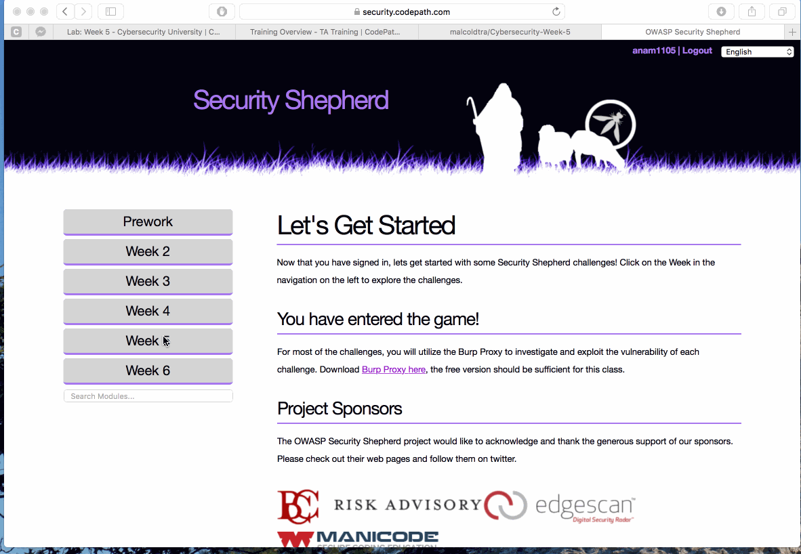

# Cybersecurity Week 5 - *anam1105* 

## Description

This is my (Ana Malhotra's) submission of the Cybersecurity Week 5 Lab.

It includes:
* Completed functionality information
* Video walkthrough, featuring:
  * Username on Security Shepard
  * Completed challenges on Security Shepard
* Notes on challenges encountered
* Installation Instructions
* License information

Time spent: **3** hours spent in total 

## User Stories

The following **required** functionality is completed:

1. [x]  Required: Challenge 0 - Insecure Cryptographic Storage
2. [x]  Required: Challenge 1 - Insecure Cryptographic Storage Challenge 1
3. [x]  Required: Challenge 2 - Insecure Cryptographic Storage Challenge 2
4. [x]  Required: Challenge 3 - PGP

The following advanced user stories are optional:

* [ ]  Bonus 1: Insecure Cryptographic Storage Challenge 3 

## Video Walkthrough

Here's a walkthrough of implemented user stories:

GIF created with [LiceCap](http://www.cockos.com/licecap/).

## Notes

This lab was definitely more challenging than the week before. I still need to learn how to spot patterns in encryption methods. For example, a student was able to figure out that a challenge needed three rounds of decoding but I wouldn't have gotten that challenge without his help.

## Installation Instructions

Setup instructions can be found on the Week 5 Lab page.

It should be noted that any browser can be used; however, Chrome and Firefox have one the most user-friendly Inspect Element interfaces.

## License

    Copyright [2017] [Ana Malhotra]

    Licensed under the Apache License, Version 2.0 (the "License");
    you may not use this file except in compliance with the License.
    You may obtain a copy of the License at

        http://www.apache.org/licenses/LICENSE-2.0

    Unless required by applicable law or agreed to in writing, software
    distributed under the License is distributed on an "AS IS" BASIS,
    WITHOUT WARRANTIES OR CONDITIONS OF ANY KIND, either express or implied.
    See the License for the specific language governing permissions and
    limitations under the License.
